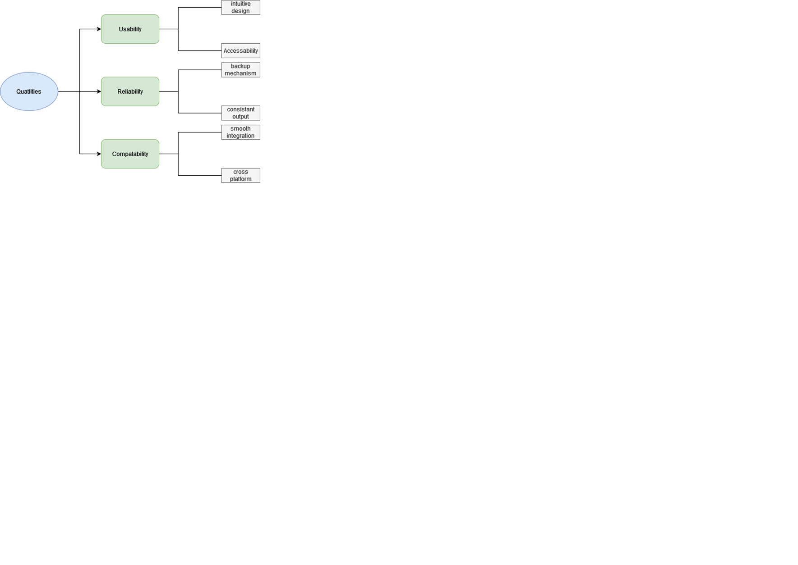

# 

**About arc42**

arc42, the template for documentation of software and system
architecture.

Template Version 8.2 EN. (based upon AsciiDoc version), January 2023

Created, maintained and © by Dr. Peter Hruschka, Dr. Gernot Starke and
contributors. See <https://arc42.org>.

This version of the template contains some help and explanations. It is
used for familiarization with arc42 and the understanding of the
concepts. For documentation of your own system you use better the
*plain* version.

# Introduction and Goals

Fancygram is a unique social media platform tailored for those who love sharing and discovering exceptional images not commonly found on other platforms. Our main goal is to provide a creative space for users to showcase their editing skills, connect with like-minded individuals, and have fun with challenges and competitions. Fancygram is more than just a platform; it's a commitment to creativity, community, and quality. By meeting the expectations of our diverse stakeholders, Fancygram aims to be a space where visual expression has limitless possibilities.

## Requirements Overview

Fancygram is a specialized platform crafted with the primary goal of empowering users to share and explore visually stunning, high-quality images that are distinctive from what is commonly found on other social media platforms. Its core mission is to facilitate the seamless sharing of such exceptional visuals within a tight-knit community. The app offers a range of essential features, including advanced tools for editing pictures, intuitive mechanisms for sharing and sorting images, seamless connectivity among users, opportunities to share editing tips and techniques, and an avenue for creating and participating in engaging challenges and competitions within the user community.

| Feature                           | Use Case                                                                             |
|---------------------------------------|------------------------------------------------------------------------------------------|
| Photo Editing with Advanced Tools | Users creatively modify images using an array of advanced editing tools.                 |
| Image Sharing and Sorting          | Users upload, organize, and share their images, creating personalized galleries.         |
| User Connections*                  | Users engage in conversations, collaborate on projects, and connect with like-minded individuals. |
| Share Editing Tips and Techniques | Users exchange insights, techniques, and tutorials, fostering a culture of learning.        |
| Challenges and Competitions       | Users create and participate in challenges, adding a gamified layer to the platform.      |

## Quality Goals

| Quality Goals |               |                                                                                                           |
|---------------|---------------|-----------------------------------------------------------------------------------------------------------|
| Priority      | Quality       | Motivation                                                                                                |
| 1             | Usability     | Users are more likely to continue using the app, recommend it to others                                   |
| 2             | Reliability   | A trustworthy app builds trust with users and they are more likely to rely on it for sharing their images |
| 3             | Compatibility | Users should be able to use the app on their preferred devices.                                           |

A table with quality goals and concrete scenarios, ordered by priorities

## Stakeholders

|     Role/Name                        |  Contact details                  |     Expectations                                                                                                     |
|--------------------------------------|-----------------------------------|----------------------------------------------------------------------------------------------------------------------|
|     Photography enthusiast/expert    |  Lucas.Rodriguez@gmail.com        |     Multifunctional editing tool. Sharing   their images/filters with others                                         |
|     Pixlr                            |  pix.lr@gmail.com                 |     An app which uses and incorporates good   features                                                               |
|     Financial department             |  Laura.Kraner@gmail.com           |     A good pricing to the app which   provides the necessary funds for the company                                   |
|     Marketing Manager                |  Sahra.chen@gmail.com             |     Unique selling points and features to   highlight in promotional materials     Insight to the target audience    |
|     Indian bilionaire               |  dominig.Kalikal.senior@gmail.com |     A user friendly app with good community guidelines and no explicit content                                       |

# Architecture Constraints

### Technical Constraints 
| ID  | Constraints                                       | Background and/or Motivation                                                                                                                                                                                                                                |
|-----|---------------------------------------------------|-------------------------------------------------------------------------------------------------------------------------------------------------------------------------------------------------------------------------------------------------------------|
| TB1 | Memory friendly                                   | Memory can be limited (due to availability on a shared host or deployment to cloud based host).  If deployed to a cloud based solution, every megabyte of memory costs this especially effects us  due to us being a startup and not well funded as of now. |
| TB2 | Deployable to a Linux server                      | Linux is suitable for industries that require customization, flexibility,  and low cost which we would prefer in the early stages of our project.                                                                                                           |
| TB3 | Third party software must be available (PIXLR)    | Third party services libraries have their own requirements and limitations.  Furthermore licensing is key with these services, however it has to be confirmed  that the used filters fulfill our requirements and guidelines.                               |
| TB4 | Data and Privacy regulations  (EU, USA and China) | Due to the large amount of data stored from the various user some guidelines  need to be upheld for the safety of our users as well as protection from legal repercussions.                                                                                 |
| TB5 | Budget requirements                               | As a startup we only have a small budget (100 000 EUR).                                                                           

### Organizational Constraints
| ID  | Constraints | Background and/or Motivation                                        
|-----|-------------|---------------------------------------------------------------------|
| OB1 | Team        | The team consists of Lin Hao, Hickelsberger and Kalarickal Dominic. |

# System Scope and Context

    
### Buisness Context

| **User/System**  | **Description**                              | **Input**                                    | **Output**                                      |
|------------------|----------------------------------------------|----------------------------------------------|-------------------------------------------------|
| User             | The user interacting with Fancygram          | Uploads images                               | View edited images                              |
| Fancygram        | The image sharing app                        | Receives image uploads                       | Processes and stores images                     |
| AWS              | Cloud storage service                        | Receives images from Fancygram               | Stores and retrieves images in the cloud        |
| Pixlr            | Image editing service providing filters      | Receives images from Fancygram for filtering | Returns edited images with applied filers       |
| Social Media     | User are connected on social media           | Shares edited images from fancygram          | Displays shared images on respective platforms  |
| Filters Database | Database storing custom and pre-made filters | Retrieves filters for image editing          | Stores and updates filters for future use       |

## Technical Context

**Contents**

Technical interfaces (channels and transmission media) linking your
system to its environment. In addition a mapping of domain specific
input/output to the channels, i.e. an explanation which I/O uses which
channel.

**Motivation**

Many stakeholders make architectural decision based on the technical
interfaces between the system and its context. Especially infrastructure
or hardware designers decide these technical interfaces.

**Form**

E.g. UML deployment diagram describing channels to neighboring systems,
together with a mapping table showing the relationships between channels
and input/output.

**\<Diagram or Table>**

**\<optionally: Explanation of technical interfaces>**

**\<Mapping Input/Output to Channels>**

# Solution Strategy

| Goal/Requirements | Architectural Approach                                                                          |
|-------------------|-------------------------------------------------------------------------------------------------|
| Reliability       | Through the possibility to fix certain areas with the entire system not crashing→  Microservice |
| Scalability       | the possibility to expand our structure when the app gains a lot of attention                   |
| User experience   | Bootstrap (html &css) in crafting visually appealing designs                                    |

# Building Block View

**Content**

The building block view shows the static decomposition of the system
into building blocks (modules, components, subsystems, classes,
interfaces, packages, libraries, frameworks, layers, partitions, tiers,
functions, macros, operations, data structures, …) as well as their
dependencies (relationships, associations, …)

This view is mandatory for every architecture documentation. In analogy
to a house this is the *floor plan*.

**Motivation**

Maintain an overview of your source code by making its structure
understandable through abstraction.

This allows you to communicate with your stakeholder on an abstract
level without disclosing implementation details.

**Form**

The building block view is a hierarchical collection of black boxes and
white boxes (see figure below) and their descriptions.

**Level 1** is the white box description of the overall system together
with black box descriptions of all contained building blocks.

**Level 2** zooms into some building blocks of level 1. Thus it contains
the white box description of selected building blocks of level 1,
together with black box descriptions of their internal building blocks.

**Level 3** zooms into selected building blocks of level 2, and so on.

See [Building Block View](https://docs.arc42.org/section-5/) in the
arc42 documentation.

## Whitebox Overall System

Here you describe the decomposition of the overall system using the
following white box template. It contains

-   an overview diagram

-   a motivation for the decomposition

-   black box descriptions of the contained building blocks. For these
    we offer you alternatives:

    -   use *one* table for a short and pragmatic overview of all
        contained building blocks and their interfaces

    -   use a list of black box descriptions of the building blocks
        according to the black box template (see below). Depending on
        your choice of tool this list could be sub-chapters (in text
        files), sub-pages (in a Wiki) or nested elements (in a modeling
        tool).

-   (optional:) important interfaces, that are not explained in the
    black box templates of a building block, but are very important for
    understanding the white box. Since there are so many ways to specify
    interfaces why do not provide a specific template for them. In the
    worst case you have to specify and describe syntax, semantics,
    protocols, error handling, restrictions, versions, qualities,
    necessary compatibilities and many things more. In the best case you
    will get away with examples or simple signatures.

***\<Overview Diagram>***

Motivation  
*\<text explanation>*

Contained Building Blocks  
*\<Description of contained building block (black boxes)>*

Important Interfaces  
*\<Description of important interfaces>*

Insert your explanations of black boxes from level 1:

If you use tabular form you will only describe your black boxes with
name and responsibility according to the following schema:

| **Name**         | **Responsibility** |
|------------------|--------------------|
| *\<black box 1>* |  *\<Text>*         |
| *\<black box 2>* |  *\<Text>*         |

If you use a list of black box descriptions then you fill in a separate
black box template for every important building block . Its headline is
the name of the black box.

### \<Name black box 1>

Here you describe \<black box 1> according the the following black box
template:

-   Purpose/Responsibility

-   Interface(s), when they are not extracted as separate paragraphs.
    This interfaces may include qualities and performance
    characteristics.

-   (Optional) Quality-/Performance characteristics of the black box,
    e.g.availability, run time behavior, ….

-   (Optional) directory/file location

-   (Optional) Fulfilled requirements (if you need traceability to
    requirements).

-   (Optional) Open issues/problems/risks

*\<Purpose/Responsibility>*

*\<Interface(s)>*

*\<(Optional) Quality/Performance Characteristics>*

*\<(Optional) Directory/File Location>*

*\<(Optional) Fulfilled Requirements>*

*\<(optional) Open Issues/Problems/Risks>*

### \<Name black box 2>

*\<black box template>*

### \<Name black box n>

*\<black box template>*

### \<Name interface 1>

…

### \<Name interface m>

## Level 2

Here you can specify the inner structure of (some) building blocks from
level 1 as white boxes.

You have to decide which building blocks of your system are important
enough to justify such a detailed description. Please prefer relevance
over completeness. Specify important, surprising, risky, complex or
volatile building blocks. Leave out normal, simple, boring or
standardized parts of your system

### White Box *\<building block 1>*

…describes the internal structure of *building block 1*.

*\<white box template>*

### White Box *\<building block 2>*

*\<white box template>*

…

### White Box *\<building block m>*

*\<white box template>*

## Level 3

Here you can specify the inner structure of (some) building blocks from
level 2 as white boxes.

When you need more detailed levels of your architecture please copy this
part of arc42 for additional levels.

### White Box \<\_building block x.1\_\>

Specifies the internal structure of *building block x.1*.

*\<white box template>*

### White Box \<\_building block x.2\_\>

*\<white box template>*

### White Box \<\_building block y.1\_\>

*\<white box template>*

# Runtime View

**Contents**

The runtime view describes concrete behavior and interactions of the
system’s building blocks in form of scenarios from the following areas:

-   important use cases or features: how do building blocks execute
    them?

-   interactions at critical external interfaces: how do building blocks
    cooperate with users and neighboring systems?

-   operation and administration: launch, start-up, stop

-   error and exception scenarios

Remark: The main criterion for the choice of possible scenarios
(sequences, workflows) is their **architectural relevance**. It is
**not** important to describe a large number of scenarios. You should
rather document a representative selection.

**Motivation**

You should understand how (instances of) building blocks of your system
perform their job and communicate at runtime. You will mainly capture
scenarios in your documentation to communicate your architecture to
stakeholders that are less willing or able to read and understand the
static models (building block view, deployment view).

**Form**

There are many notations for describing scenarios, e.g.

-   numbered list of steps (in natural language)

-   activity diagrams or flow charts

-   sequence diagrams

-   BPMN or EPCs (event process chains)

-   state machines

-   …

See [Runtime View](https://docs.arc42.org/section-6/) in the arc42
documentation.

## \<Runtime Scenario 1>

-   *\<insert runtime diagram or textual description of the scenario>*

-   *\<insert description of the notable aspects of the interactions
    between the building block instances depicted in this diagram.>*

## \<Runtime Scenario 2>

## …

## \<Runtime Scenario n>

# Deployment View

**Content**

The deployment view describes:

1.  technical infrastructure used to execute your system, with
    infrastructure elements like geographical locations, environments,
    computers, processors, channels and net topologies as well as other
    infrastructure elements and

2.  mapping of (software) building blocks to that infrastructure
    elements.

Often systems are executed in different environments, e.g. development
environment, test environment, production environment. In such cases you
should document all relevant environments.

Especially document a deployment view if your software is executed as
distributed system with more than one computer, processor, server or
container or when you design and construct your own hardware processors
and chips.

From a software perspective it is sufficient to capture only those
elements of an infrastructure that are needed to show a deployment of
your building blocks. Hardware architects can go beyond that and
describe an infrastructure to any level of detail they need to capture.

**Motivation**

Software does not run without hardware. This underlying infrastructure
can and will influence a system and/or some cross-cutting concepts.
Therefore, there is a need to know the infrastructure.

Maybe a highest level deployment diagram is already contained in section
3.2. as technical context with your own infrastructure as ONE black box.
In this section one can zoom into this black box using additional
deployment diagrams:

-   UML offers deployment diagrams to express that view. Use it,
    probably with nested diagrams, when your infrastructure is more
    complex.

-   When your (hardware) stakeholders prefer other kinds of diagrams
    rather than a deployment diagram, let them use any kind that is able
    to show nodes and channels of the infrastructure.

See [Deployment View](https://docs.arc42.org/section-7/) in the arc42
documentation.

## Infrastructure Level 1

Describe (usually in a combination of diagrams, tables, and text):

-   distribution of a system to multiple locations, environments,
    computers, processors, .., as well as physical connections between
    them

-   important justifications or motivations for this deployment
    structure

-   quality and/or performance features of this infrastructure

-   mapping of software artifacts to elements of this infrastructure

For multiple environments or alternative deployments please copy and
adapt this section of arc42 for all relevant environments.

***\<Overview Diagram>***

Motivation  
*\<explanation in text form>*

Quality and/or Performance Features  
*\<explanation in text form>*

Mapping of Building Blocks to Infrastructure  
*\<description of the mapping>*

## Infrastructure Level 2

Here you can include the internal structure of (some) infrastructure
elements from level 1.

Please copy the structure from level 1 for each selected element.

### *\<Infrastructure Element 1>*

*\<diagram + explanation>*

### *\<Infrastructure Element 2>*

*\<diagram + explanation>*

…

### *\<Infrastructure Element n>*

*\<diagram + explanation>*

# Cross-cutting Concepts

**Content**

This section describes overall, principal regulations and solution ideas
that are relevant in multiple parts (= cross-cutting) of your system.
Such concepts are often related to multiple building blocks. They can
include many different topics, such as

-   models, especially domain models

-   architecture or design patterns

-   rules for using specific technology

-   principal, often technical decisions of an overarching (=
    cross-cutting) nature

-   implementation rules

**Motivation**

Concepts form the basis for *conceptual integrity* (consistency,
homogeneity) of the architecture. Thus, they are an important
contribution to achieve inner qualities of your system.

Some of these concepts cannot be assigned to individual building blocks,
e.g. security or safety.

**Form**

The form can be varied:

-   concept papers with any kind of structure

-   cross-cutting model excerpts or scenarios using notations of the
    architecture views

-   sample implementations, especially for technical concepts

-   reference to typical usage of standard frameworks (e.g. using
    Hibernate for object/relational mapping)

**Structure**

A potential (but not mandatory) structure for this section could be:

-   Domain concepts

-   User Experience concepts (UX)

-   Safety and security concepts

-   Architecture and design patterns

-   "Under-the-hood"

-   development concepts

-   operational concepts

Note: it might be difficult to assign individual concepts to one
specific topic on this list.

See [Concepts](https://docs.arc42.org/section-8/) in the arc42
documentation.

## *\<Concept 1>*

*\<explanation>*

## *\<Concept 2>*

*\<explanation>*

…

## *\<Concept n>*

*\<explanation>*

# Architecture Decisions

### Architecture Decision Table

| Problem                    | Considered Alternatives                                         | Decision                                  |
|----------------------------|----------------------------------------------------------------|-------------------------------------------|
| Database Size Unknown      | • In-House Database  • Online NoSQL Database                | Online NoSQL Database on AWS              |
| Microservices Cost         | • Monolith  • Microservices  • SOA                       | Microservices                             |
| Different Types of Data    | • Forcing Users to Use One Type  • Converting Images to a Standard Format | Converting Images to a Standard Format     |
| Platform Scalability       | • Vertical Scaling  • Horizontal Scaling                    | Horizontal Scaling (to accommodate growth)|
| User Authentication        | • OAuth  • JWT Tokens                                       | OAuth (for a secure and user-friendly experience)  |
| Database Hosting           | • AWS  • Azure  • Google Cloud                           | AWS                                       |

# Quality Requirements

**Content**

This section contains all quality requirements as quality tree with
scenarios. The most important ones have already been described in
section 1.2. (quality goals)

Here you can also capture quality requirements with lesser priority,
which will not create high risks when they are not fully achieved.

**Motivation**

Since quality requirements will have a lot of influence on architectural
decisions you should know for every stakeholder what is really important
to them, concrete and measurable.

See [Quality Requirements](https://docs.arc42.org/section-10/) in the
arc42 documentation.

## Quality Tree

## Quality Scenarios

| Quality Attribute  | Description |
|--------------------|-------------|
| Intuitive Design   | The design is user-friendly and easy to navigate, reducing the learning curve for new users. |
| Accessibility      | The system is equipped with features to aid users with disabilities, including screen readers, keyboard shortcuts, and colorblind-friendly palettes. |
| Backup Mechanism    | There is a robust backup system in place to ensure users' data is stored securely and can be recovered in case of any failure. |
| Consistent Output   | The system performs reliably, delivering consistent output regardless of varying loads or conditions. |
| Smooth Integration  | The system integrates seamlessly with third-party services, maintaining high performance and compatibility. |
| Cross-Platform      | The system's interface and functionality are consistent across different operating systems, ensuring a uniform user experience. |

# Risks and Technical Debts

**Contents**

| Risk/Technical Debt              | Description | Preventive Measures |
|----------------------------------|-------------|---------------------|
| Inadequate Scalability           | Systems could be slow, unresponsive, or crash during high traffic periods. | Utilize microservices architecture to enhance scalability and manage high traffic more efficiently. |
| Documentation Debt               | Due to the fast growth of the system, certain additions might be falsely or not documented at all. | Implement continuous integration practices that include automatic documentation generation and regular reviews to ensure accuracy and completeness. |
| Third-Party Service Dependencies | If a third-party service has problems or difficulties, it can negatively impact our app. | Design the system with fallback options and ensure microservices can operate independently to reduce reliance on any single third-party service. |
| Technical Obsolescence           | The technology stack may become outdated, leading to increased security risks and maintenance challenges. | Regularly review and update the technology stack to current standards and invest in training for the development team on emerging technologies. |

# Glossary

**Contents**

The most important domain and technical terms that your stakeholders use
when discussing the system.

You can also see the glossary as source for translations if you work in
multi-language teams.

**Motivation**

You should clearly define your terms, so that all stakeholders

-   have an identical understanding of these terms

-   do not use synonyms and homonyms

A table with columns \<Term> and \<Definition>.

Potentially more columns in case you need translations.

See [Glossary](https://docs.arc42.org/section-12/) in the arc42
documentation.

| Term        | Definition        |
|-------------|-------------------|
| *\<Term-1>* | *\<definition-1>* |
| *\<Term-2>* | *\<definition-2>* |
