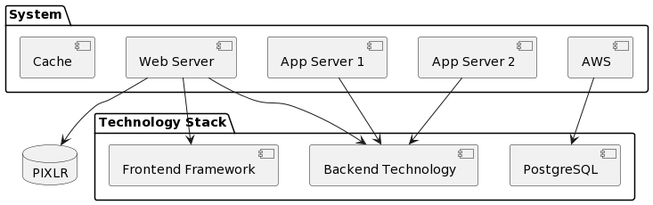
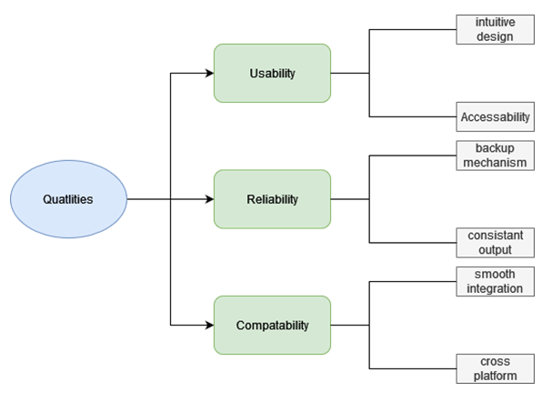

# 

**About arc42**

arc42, the template for documentation of software and system
architecture.

Template Version 8.2 EN. (based upon AsciiDoc version), January 2023

Created, maintained and © by Dr. Peter Hruschka, Dr. Gernot Starke and
contributors. See <https://arc42.org>.

This version of the template contains some help and explanations. It is
used for familiarization with arc42 and the understanding of the
concepts. For documentation of your own system you use better the
*plain* version.

# Introduction and Goals

Fancygram will be a unique Social Media Platform where users can share their stunning images. These exceptional images can be modified by the in-app editing program. Our mission is to connect like minded individuals through their visual expressions. User cannot only share their images, but also their editing tips and tricks. The community will be challenged with engaging competitions and task where user interaction will be the key to winning. 

To ensure that every stakeholder is satisfied Fancygram will meet the requirements of diverse Data protection guidelines so that its users can trust the team and. The system should also be designed for accessibility and consistency for the best user experience. The system should be designed for minimal downtime and best user experience. 

## Requirements Overview

 

| Feature                           | Use Case                                                                             |
|---------------------------------------|------------------------------------------------------------------------------------------|
| Photo Editing with Advanced Tools | Users creatively modify images using an array of advanced editing tools.                 |
| Image Sharing and Sorting          | Users upload, organize, and share their images, creating personalized galleries.         |
| User Connections*                  | Users engage in conversations, collaborate on projects, and connect with like-minded individuals. |
| Share Editing Tips and Techniques | Users exchange insights, techniques, and tutorials, fostering a culture of learning.        |
| Challenges and Competitions       | Users create and participate in challenges, adding a gamified layer to the platform.      |

## Quality Goals

| Quality Goals |               |                                                                                                           |
|---------------|---------------|-----------------------------------------------------------------------------------------------------------|
| Priority      | Quality       | Motivation                                                                                                |
| 1             | Usability     | Users are more likely to continue using the app, recommend it to others                                   |
| 2             | Reliability   | A trustworthy app builds trust with users and they are more likely to rely on it for sharing their images |
| 3             | Compatibility | Users should be able to use the app on their preferred devices.                                           |

A table with quality goals and concrete scenarios, ordered by priorities

## Stakeholders

|     Role/Name                        |  Contact details                  |     Expectations                                                                                                     |
|--------------------------------------|-----------------------------------|----------------------------------------------------------------------------------------------------------------------|
|     Photography enthusiast/expert    |  Lucas.Rodriguez@gmail.com        |     Multifunctional editing tool. Sharing   their images/filters with others                                         |
|     Pixlr                            |  pix.lr@gmail.com                 |     An app which uses and incorporates good   features                                                               |
|     Financial department             |  Laura.Kraner@gmail.com           |     A good pricing to the app which   provides the necessary funds for the company                                   |
|     Marketing Manager                |  Sahra.chen@gmail.com             |     Unique selling points and features to   highlight in promotional materials     Insight to the target audience    |
|     Indian bilionaire               |  dominig.Kalikal.senior@gmail.com |     A user friendly app with good community guidelines and no explicit content                                       |

# Architecture Constraints

### Technical Constraints 
| ID  | Constraints                                       | Background and/or Motivation                                                                                                                                                                                                                                |
|-----|---------------------------------------------------|-------------------------------------------------------------------------------------------------------------------------------------------------------------------------------------------------------------------------------------------------------------|
| TB1 | Memory friendly                                   | Memory can be limited (due to availability on a shared host or deployment to cloud based host).  If deployed to a cloud based solution, every megabyte of memory costs this especially effects us  due to us being a startup and not well funded as of now. |
| TB2 | Deployable to a Linux server                      | Linux is suitable for industries that require customization, flexibility,  and low cost which we would prefer in the early stages of our project.                                                                                                           |
| TB3 | Third party software must be available (PIXLR)    | Third party services libraries have their own requirements and limitations.  Furthermore licensing is key with these services, however it has to be confirmed  that the used filters fulfill our requirements and guidelines.                               |
| TB4 | Data and Privacy regulations  (EU, USA and China) | Due to the large amount of data stored from the various user some guidelines  need to be upheld for the safety of our users as well as protection from legal repercussions.                                                                                 |
| TB5 | Budget requirements                               | As a startup we only have a small budget (100 000 EUR).                                                                           

### Organizational Constraints
| ID  | Constraints | Background and/or Motivation                                        
|-----|-------------|---------------------------------------------------------------------|
| OB1 | Team        | The team consists of Lin Hao, Hickelsberger and Kalarickal Dominic. |

# System Scope and Context

    
### Buisness Context

| **User/System**  | **Description**                              | **Input**                                    | **Output**                                      |
|------------------|----------------------------------------------|----------------------------------------------|-------------------------------------------------|
| User             | The user interacting with Fancygram          | Uploads images                               | View edited images                              |
| Fancygram        | The image sharing app                        | Receives image uploads                       | Processes and stores images                     |
| AWS              | Cloud storage service                        | Receives images from Fancygram               | Stores and retrieves images in the cloud        |
| Pixlr            | Image editing service providing filters      | Receives images from Fancygram for filtering | Returns edited images with applied filers       |
| Social Media     | User are connected on social media           | Shares edited images from fancygram          | Displays shared images on respective platforms  |
| Filters Database | Database storing custom and pre-made filters | Retrieves filters for image editing          | Stores and updates filters for future use       |

## Technical Context

**Contents**

| Component                   | Description                                                                                                                                                                                                  | Input                          | output                                  |
|-----------------------------|--------------------------------------------------------------------------------------------------------------------------------------------------------------------------------------------------------------|--------------------------------|-----------------------------------------|
| Web Server                  | The web server is responsible for handling HTTP requests and responses, serving as an API gateway.                                                                                                           | http requests                  | http response with requested data       |
| App Server 1,2              | Execute server-side application logic, handling the editing of our pictrues, and creating a connection to our AWS databases.                                                                                 | Request from Web Server        | Response of processed request           |
| Database                    | Central database where user data, images and filters are stored and retrieved.                                                                                                                               | SQL commands and/or Data       | Data                                    |
| Cache                       | We implemented a caching layer to increase our preformance speed. A more detailed expalanation is accesable in the point Deployment view.                                                                    | Data                           | cached Data or messages related to data |
| Backend                     | With microservices being our architecture and our platform being avalable for web, IOS and Andriod we used backend as a placeholder for the various programming languages.                                   |                                |                                         |
| Frontend                    | With microservices being our architecture and our platform being avalable for web, IOS and Andriod we used frontend as a placeholder for various Libraries, styling languages as well as formating elements. | user interactions              | update page                             |
| PostgreSQL                  | Is used as a relation database model. It not only is open source but also is compatable with AWS and is even offered as integrated service by Amazon (Amazon RDS (Relational Database Service))              | comands                        | data                                    |
| External Service (Database) | Represents an external service, such as AWS , facilitating seamless integration with Pixlr.                                                                                                                  | requests from front or backend | Filters                                 |

Technical interfaces (channels and transmission media) linking your
system to its environment. In addition a mapping of domain specific
input/output to the channels, i.e. an explanation which I/O uses which
channel.

**Motivation**

Many stakeholders make architectural decision based on the technical
interfaces between the system and its context. Especially infrastructure
or hardware designers decide these technical interfaces.

**Form**

E.g. UML deployment diagram describing channels to neighboring systems,
together with a mapping table showing the relationships between channels
and input/output.

**\<Diagram or Table>**

**\<optionally: Explanation of technical interfaces>**

**\<Mapping Input/Output to Channels>**

# Solution Strategy

We want to archive consistency, easy deployment, and updates by using microservices architecture. This will make sure that Fancygram will be more resilient to failure and or overload. This should run smoothly because as time approaches, more of the commodity will be demanded. Therefore, we want to design a flexible system which is expected to increase in size as more people are using the app. Through this, Fancygram would capture more users, photographs, many other things. This way, we can predict on how Fancygram could grow with its increasing user base. The reason we selected Bootstrap is to give Fancygram a simple but beautiful view. This is all about designing a simple atmosphere of Fancygram platform. 
Moreover, we have addressed some big concerns and questions raised on the technological options. First, we have chosen AWS simply for its dependability since it will be easy to scale as the business expands. We have an agile approach, which keeps our flexibility high and improves interactions among team members. Using Java for our web applications and a fast API(MQTT) design so that microservices can communicate with each other efficiently.

# Building Block View

**Content**

The building block view shows the static decomposition of the system
into building blocks (modules, components, subsystems, classes,
interfaces, packages, libraries, frameworks, layers, partitions, tiers,
functions, macros, operations, data structures, …) as well as their
dependencies (relationships, associations, …)

This view is mandatory for every architecture documentation. In analogy
to a house this is the *floor plan*.

**Motivation**

Maintain an overview of your source code by making its structure
understandable through abstraction.

This allows you to communicate with your stakeholder on an abstract
level without disclosing implementation details.

**Building Block View**

**Whitebox view**
    
**Level 1**

Our system consists of eight main groupings. The Editor is our main program which is our company developed. The other Block interact with outer systems to provide information to our editing tool. As portrayed in the diagram bellow these consist of an upload to various social media platforms, a cloud storage system , a payment option as well as location services    

 
 1 uploads: are responsible for distributing our edited images to outer systems. It can stand alone and be used to upload different files to other platforms if utilized for a different sales point. 

 2 payment: controls the flow of money in our company. Moreover it also regulates which content is permitted to specific users, by passing on order confirmations to the user management. 
 
 3 User management: transfers user data to the editor to permit certain features. Moreover this Block handles the users and allows them to log in and sign up and manage their accounts. This can also be done by system administrators

 4 Location: is used to accurately portray the current location of the users in images (if they want to and allow the function) so that they can share it to their community and show it as a sign of status. Moreover it helps customize certian features and filters for countries as well as language settings. This can however be disabled within the users device.

5 File storage system AWS: is used to store filters, pictures and data.  this cooperates with user management and the editor aswell as the filters supplied and stored by pixlr. 

6 Filters: are responsible for allowing users to saave and expand filters created by the editing tool and linking them to the Filters from Pixlr.
 
7 Editor: This component is the heart of our System. It can be used to modify images and filters aswell as layer these. 

**Level 2** 

 **editor**
 
 The editor consists of 7 blocks of which 3 communicate with outer systems. these allow the editor to accept pictures, export them through uploads as well as customizing filters. 

 
 

 

 

1 Picture editing: consists of the user operating the tools inside the app and utilizing them to improve the images.

2 Remodelling tools: provides the necessary tools to customise images as well as filters to improve them to the specific needs of the user

3 Layer management: allows the user to apply more than one filter onto images or even layer filters over each other to create a new one. This can also be restricted due to free and premium user imbalance.

4 Effects and filters: contain the already created filters with certain effects which have already been created. This includes already layered effects.

5 Text tools: consist of all different elements used to output
text onto images and filters. these can also be incorporated with location services to accurately portray locations and situations.

6 Remodelling tools: are used to customize images and filters and complete the image or filter to the specific users liking . Moreover they are combined with  User management to ensure users get the Filters they paid for.

**Picture**

1 Virus checker: check if the file is not corupted and all data still works.

2 Format checker: check format to ensure it can be handeld from our system.

3 Image converter: if the format doesnt match the needed format, it gets converted to png so it can be edited on our application.

4 Filter Applicator: filters can be applied to the image when uploaded.

**User Management**

1 Data saver: Controlls the data of the user and the inputs while registering. they then can be processed and stored to a database.

2 Data revison: entered data can be revised and changed. The changed values of course get validated again and then stored in the database

3 account permission: The value if a payment has occured from this account is revieced from the financial division and then the permsissions can be passed on to the editor. Furthermore this also entails the oportunity to advertise and add the posiblity of further payments to this account.

**locations** 

stores locations with timestamps in near realtime and provides access to locations for the last 30 minutes

1 LocationController: manages the current locations needed for the app to post them on your images.

2 LocationMessaging: this allows users transfer thier real time locations so that the app can present other users who are in their proximity.

3 LocationsListener: Gets the timezones aswell as the current time at the specified location.

4 LocationService: retrieve current coordinates of the user to accurately display them on the app allowing them to interact with users nearby as well as displaying it on their profile.

5 LocationRepository: stores locations of the past 30 min so that they can be used by the user for socialising with other users.

**Level 3** 

1 Artistic effects: are different images, emojis, gifs and tools which can be used to style and improve images and filters.

2 Filter effects: are applied to images or layered over other filters to create a new style of an image or a new filter.

3 colour corrections effects: are used to correct or improve contrasts of light or colours to make it more appealing for the user.

# Runtime View

## Runtime Scenario 1

### User Image Upload:

- The interaction begins with the User uploading an image to the Server/Editor.
- This represents a straightforward user action, initiating the image editing process.

### Permission Request to User Management:

- After receiving the image, the Server/Editor requests permission from the User Management building block.
- This step ensures that the user has the necessary permissions to access the editing tools.

### Editing Tools Request to Editing Tools Database:

- Upon obtaining permission, the Server/Editor requests the available editing tools from the Editing Tools Database.
- This interaction signifies the dynamic nature of the application, where the available tools may vary based on user permissions.

### Conditional Retrieval of Editing Tools:

- The Editing Tools Database responds differently based on the user's subscription status.
  - If the user has a paid version, all available editing tools are returned.
  - If the user has a free version, a limited set of editing tools is returned.

### Editing Tools Confirmation to User:

- The Server/Editor sends a confirmation message to the User, informing them about the editing tools they have access to.
- This confirmation is a crucial aspect of user communication, providing clarity on available features.

## Runtime Scenario: Image Sharing

### User Initiates Image Share:

- The interaction begins with the User selecting the "Share" option in the app.
- This represents a user action, indicating the intent to share an image.

### Server/Editor Provides Social Media Options:

- The Server/Editor responds by providing a list of social media platforms available for image sharing.

### User Selects Social Media Platform:

- The User selects a specific social media platform from the provided options.
- This choice determines where the image will be shared.

### Server Checks User's Login Status:

- The Server/Editor checks if the User is currently logged in to the selected social media platform.
- This verification is crucial for seamless integration with the chosen platform.

### Social Media API Validates Login Status:

- The Server/Editor sends a request to the Social Media API to validate the User's login status.
- The Social Media API responds with the confirmation of the User's login status.

### User Login Loop:

- If the User is not logged in, a loop is initiated to handle the login process.
  - The Server/Editor sends login information to the User.
  - The User provides login credentials.
  - The User's login data is sent to the Social Media API for validation.
  - The validation result is relayed back to the Server/Editor.
  - The loop continues until the User is successfully logged in.

### User Requests Image Share:

- After the login process, the User informs the Server/Editor about the intent to share an image.
- This triggers a request from the Server/Editor to the Image Storage/AWS for the selected image.

### Image Retrieval from Image Storage/AWS:

- The Image Storage/AWS responds by providing the requested image to the Server/Editor.
- This ensures that the Server/Editor has access to the image for further processing.

### Image Format Conversion:

- The Server/Editor sends the image to the Image Converter for format conversion.
- The Image Converter processes the image and returns the formatted version to the Server/Editor.

### Image Share to Social Media:

- The Server/Editor sends the formatted image to the Social Media API for sharing on the selected platform.
- The Social Media API acknowledges the successful image share.

### Confirmation to User:

- The Server/Editor sends a confirmation message to the User, indicating that the image has been successfully shared.

# Deployment View

## Infrastructure Level 1

The deployment of the image-sharing app involves multiple components distributed across various locations and environments, each contributing to the system's quality and performance features.

### Components and Connections

1. **Mobile Device and Website:**
   - Represents the user interface accessible through mobile devices and web browsers.
   - Connected to a Load Balancer for distributing incoming traffic.

2. **Load Balancer:**
   - Manages and distributes incoming requests to the Server Nodes.
   - Ensures high availability and scalability.
   

3. **Server Nodes:**
   - Handle the core functionality of the image-sharing app.
   - Connected to external services and databases for enhanced features.

4. **Pixlr:**
   - Third-party integration providing advanced image editing tools.
   - Enhances the app's editing capabilities.

5. **Caching Layer:**
   - Improves performance by caching frequently accessed data.
   - Reduces the load on the server nodes.

6. **Monitoring Tools (Nagios):**
   - Monitors the health and performance of the entire system.
   - Alerts administrators to any issues for proactive management.

7. **Multiple AWS Cloud Databases:**
   - Used for horizontal scaling to handle growing data demands.
   - Ensures data availability and reliability.

### Key Features and Motivations

- **Scalability:** The deployment structure allows horizontal scaling of the database layer in the AWS Cloud, ensuring efficient handling of increasing data volumes. This contributes to high availability and optimal performance.

- **Performance Optimization:** The inclusion of a Caching Layer enhances overall system performance by reducing the load on server nodes and minimizing response times. Monitoring Tools (Nagios) ensure proactive management and prompt issue resolution.

## Infrastructure Level 2

## Internal Structure of Server Nodes

### 1. Image Processing Module

The Image Processing Module is a critical component within the Server Nodes responsible for handling image processing tasks. This module executes various operations on the uploaded images, such as resizing, cropping, or applying filters.

### 2. Database Interaction Module

The Database Interaction Module facilitates communication between the Server Nodes and the underlying database system. It is responsible for storing and retrieving data related to user accounts, uploaded images, and other relevant information. This module ensures seamless data transactions between the server and the persistent storage.

#### Connections:

- **Image Processing Module to Database Interaction Module:** Communication occurs to store or retrieve possibly processed images. For example, processed images may need to be stored for future reference or retrieved for further editing.

### 3. Pixlr Integration Module

The Pixlr Integration Module is an external component called by the Server Nodes. It enables the integration of Pixlr, a third-party editing tool. This module acts as a bridge between the Server Nodes and Pixlr, allowing users to access advanced editing tools for their images.

### 4. Caching Management Module

The Caching Management Module is responsible for optimizing data access by managing a cache. It stores frequently accessed data locally, reducing the need to fetch the same data repeatedly from the database. This module enhances performance by minimizing latency in data retrieval.

#### Connections:

- **Caching Management Module to Database Interaction Module:** The cache is updated or retrieved based on data changes in the underlying database.

### 5. Monitoring Integration Module

The Monitoring Integration Module plays a crucial role in maintaining the health and performance of the internal modules within the Server Nodes. It integrates with monitoring tools, such as Nagios, to track various metrics, detect anomalies, and generate alerts if issues arise.

# Cross-cutting Concepts

## Security and Safety

We decided that Fancygram should follow the EU GDPR to ensure that user can put trust in our application. The data saved should always be retrievable and transparent. As for threat modelling, each design idea is being looked at to try to find weaknesses that may impact our system. Everything should be designed to anticipate threats and prevent security risks.

At last, the access control for users should be kept at the bare minimum. Each user should only get minimum access to perform the task needed. This is to prevent data breaches and improve data security.

## Architecture

For architecture, it has been decided to use microservices for improved resilience and scalability. The microservices communicate with each other with MQTT API for real-time data exchange and lightweight protocol.

To prevent system overloading, it has been decided to use AWS Elastic Load Balancing tool. It will not only improve event distribution but also prevent bottlenecks and system unresponsiveness.

## Operation Concepts

To keep the downtime as low as possible, everything should be monitored. The decision has fallen on the Nagios Monitoring system to monitor system health. It will be able to detect system failure, overload, or unresponsiveness. Furthermore, auto-scaling policies will be defined, so that each system does not need any manual work to scale if necessary.

For minimal downtime, Continuous Integration and Deployment will be used so that code changes are built and tested automatically.

# Architecture Decisions

### Architecture Decision Table

| Problem                    | Considered Alternatives                                         | Decision                                  |
|----------------------------|----------------------------------------------------------------|-------------------------------------------|
| Database Size Unknown      | • In-House Database  • Online NoSQL Database                | Online NoSQL Database on AWS              |
| Microservices Cost         | • Monolith  • Microservices  • SOA                       | Microservices                             |
| Platform Scalability       | • Vertical Scaling  • Horizontal Scaling                    | Horizontal Scaling (to accommodate growth)|
| Different Types of Data    | • Forcing Users to Use One Type  • Converting Images to a Standard Format | Converting Images to a Standard Format     |
| User Authentication        | • OAuth  • JWT Tokens                                       | OAuth (for a secure and user-friendly experience)  |
| Database Hosting           | • AWS  • Azure  • Google Cloud                           | AWS                                       |

# Quality Requirements

**Content**

This section contains all quality requirements as quality tree with
scenarios. The most important ones have already been described in
section 1.2. (quality goals)

Here you can also capture quality requirements with lesser priority,
which will not create high risks when they are not fully achieved.

**Motivation**

Since quality requirements will have a lot of influence on architectural
decisions you should know for every stakeholder what is really important
to them, concrete and measurable.

See [Quality Requirements](https://docs.arc42.org/section-10/) in the
arc42 documentation.

## Quality Tree

## Quality Scenarios

| Quality Attribute  | Description |
|--------------------|-------------|
| Intuitive Design   | The design is user-friendly and easy to navigate, reducing the learning curve for new users. |
| Accessibility      | The system is equipped with features to aid users with disabilities, including screen readers, keyboard shortcuts, and colorblind-friendly palettes. |
| Backup Mechanism    | There is a robust backup system in place to ensure users' data is stored securely and can be recovered in case of any failure. |
| Consistent Output   | The system performs reliably, delivering consistent output regardless of varying loads or conditions. |
| Smooth Integration  | The system integrates seamlessly with third-party services, maintaining high performance and compatibility. |
| Cross-Platform      | The system's interface and functionality are consistent across different operating systems, ensuring a uniform user experience. |

# Risks and Technical Debts

**Contents**

| Risk/Technical Debt              | Description | Preventive Measures |
|----------------------------------|-------------|---------------------|
| Inadequate Scalability           | Systems could be slow, unresponsive, or crash during high traffic periods. | Utilize microservices architecture to enhance scalability and manage high traffic more efficiently. |
| Documentation Debt               | Due to the fast growth of the system, certain additions might be falsely or not documented at all. | Implement continuous integration practices that include automatic documentation generation and regular reviews to ensure accuracy and completeness. |
| Third-Party Service Dependencies | If a third-party service has problems or difficulties, it can negatively impact our app. | Design the system with fallback options and ensure microservices can operate independently to reduce reliance on any single third-party service. |
| Technical Obsolescence           | The technology stack may become outdated, leading to increased security risks and maintenance challenges. | Regularly review and update the technology stack to current standards and invest in training for the development team on emerging technologies. |

# Glossary

**Contents**

The most important domain and technical terms that your stakeholders use
when discussing the system.

You can also see the glossary as source for translations if you work in
multi-language teams.

**Motivation**

You should clearly define your terms, so that all stakeholders

-   have an identical understanding of these terms

-   do not use synonyms and homonyms

A table with columns \<Term> and \<Definition>.

Potentially more columns in case you need translations.

See [Glossary](https://docs.arc42.org/section-12/) in the arc42
documentation.

| Term        | Definition        |
|-------------|-------------------|
| *\<Term-1>* | *\<definition-1>* |
| *\<Term-2>* | *\<definition-2>* |
